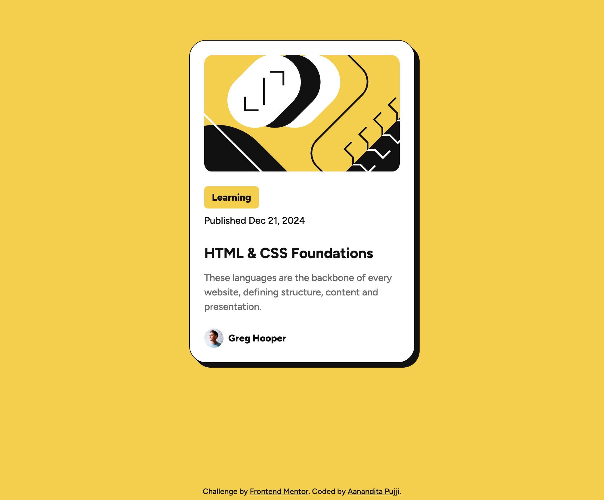

# Frontend Mentor - Blog preview card solution

## Table of contents

- [Overview](#overview)
  - [Screenshot](#screenshot)
  - [Links](#links)
- [My process](#my-process)
  - [Built with](#built-with)

## Overview

This is a solution to the [Blog preview card challenge on Frontend Mentor](https://www.frontendmentor.io/challenges/blog-preview-card-ckPaj01IcS). Frontend Mentor challenges help you improve your coding skills by building realistic projects. 

### Screenshot

### Links

- Solution URL: https://github.com/aapujji/blog-preview-card-component
- Live Site URL: https://aapujji.github.io/blog-preview-card-component/

## My process
- Started with building out the HTML based on the design image
- Worked on the CSS one area at a time until I was happy with the way everything looked

### Built with

- Semantic HTML5 markup
- CSS custom properties
- CSS Grid
- CSS Flexbox
- Mobile-first workflow